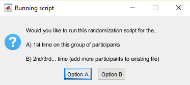
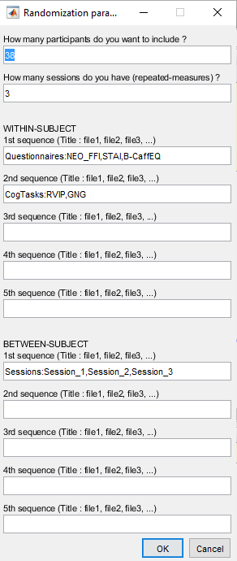
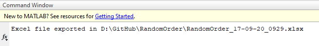
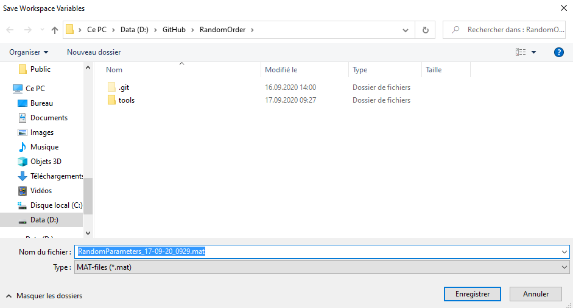
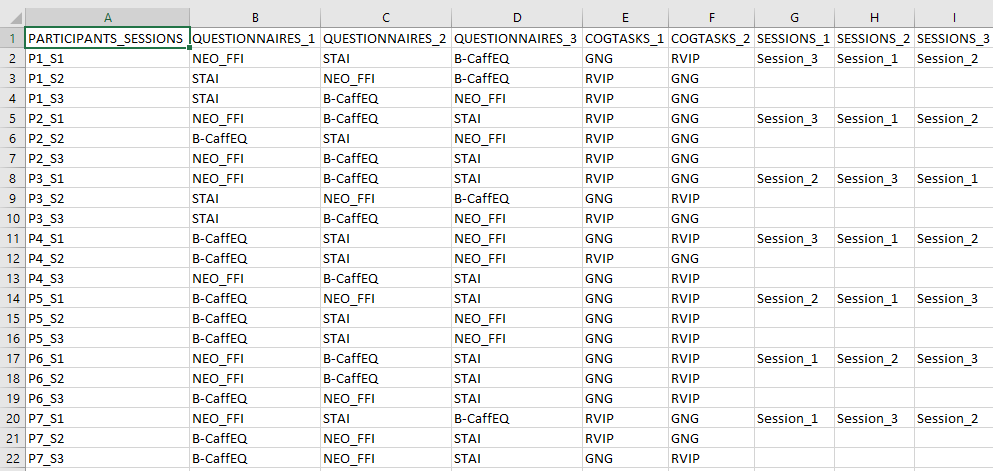

# RandomOrder

The MATLAB script in this repository enable to create lists of pseudo-randomization.


## Cite the repository
C.A. Wicht, RandomOrder, (2020), GitHub repository, https://github.com/CorentinWicht/RandomOrder \
[](https://zenodo.org/badge/latestdoi/296019359)


## Table of Contents
- [Getting Started](#getting-started)
  * [1. Number of runs](#1-number-of-runs)
  * [2. Parameters](#2-parameters)
  * [3. Exporting Workspace Variables](#3-exporting-workspace-variables)
  * [4. Excel Output](#4-excel-output)
- [Author](#author)
- [License](#license)
- [Acknowledgements](#acknowledgements)
- [Fundings](#fundings)

<small><i><a href='http://ecotrust-canada.github.io/markdown-toc/'>Table of contents generated with markdown-toc</a></i></small>


## Getting Started

When on the [GFPPeaks startup page](https://github.com/CorentinWicht/GFPPeaks), start by clicking on `⬇️ Code` on the top right of the screen and then `Download ZIP` to download the whole repository (alternatively you can also clone it). 
Then, you will need to run the following script: ```GFPPeaks.m```


You will find below a step by step explanation on how to run each script in MATLAB (by clicking on the `▶️ Run` button or on your keyboard's button `⌨️ F5`).


### 1. Number of runs



This first prompt asks you whether you are running the script for the first time or you already ran it once **for a specific project**. \
If this is not the first run, the script will take into account the pseudo-random distribution generated in the previous run in order to append new data to it. \
This strategy enables to keep the distribution as equal as possible in the different groups/conditions when adding more data to an existing project. 


### 2. Parameters



This is the main parameter prompt in which you need to specify for the **current run**:
```
1) The number of subjects you want to include/add
2) The number of sessions (i.e. number of the within-subject factor's levels)
3) In a within-subject scheme, you can include up to 5 items that you want to pseudo-randomize.
4) In a between-subject scheme, you can also include up to 5 items that you want to pseudo-randomize.
```
To have a better idea of how the output will look like once you filled the parameters prompt, check out the example below in [Chapter 4](#4-excel-output).




If the script worked correctly, you should see this output in MATLAB's Command Window. 


### 3. Exporting Workspace Variables



The script will finally ask you where do you want to store the parameters that will be retrieved if you want to add more data to an existing project. \
Default is in the path of the current folder.

If you want to dig deeper into the pseudo-random distribution of each of the defined factors, you have to open the ```Parameters``` field in the ```Out``` structure:
```
- "AllCombin" : contains all the possible combinations of each factor's levels
- "ShuffleAvailable" : based on the possible combinations for one factor's levels, this structure contains the current pseudo-random distribution (i.e. number of time each combination was used). 
```


### 4. Excel Output



This is an example of how the output Excel file will look like (i.e. the example is based on the parameters provided in [Chapter 2](#2-parameters)). 
```
- The first column will always contain the participant number and the session in the following format: Px_Sx.
- Then the next columns will correspond to the within-subjects factor levels (e.g. QUESTIONNAIRES_1)
- In the last columns you will find the between-subjects factor levels (e.g. SESSION_1)
```

How to differentiate within- and between-subjects factors levels ? \
The columns corresponding to within-subject factors levels will have all their lines filled with data while the ones corresponding to between-subjects factors levels will only have the first line of each participant filled with data (since this is not a repeated measure). 


## Author
[**Corentin Wicht**](https://www.researchgate.net/profile/Wicht_Corentin)\
*SNSF Doc.CH PhD student*\
*corentin.wicht@unifr.ch, corentinw.lcns@gmail.com*\
*[Laboratory for Neurorehabilitation Science](https://www3.unifr.ch/med/spierer/en/)*\
*University of Fribourg, Switzerland*

## License
<a rel="license" href="http://creativecommons.org/licenses/by-nc/4.0/"></a><br />This work is licensed under a <a rel="license" href="http://creativecommons.org/licenses/by-nc/4.0/">Creative Commons Attribution-NonCommercial 4.0 International License</a>.

See the [LICENSE.md](LICENSE.md) file for details

## Acknowledgements
PD Dr. Lucas Spierer, Director of the [Laboratory for Neurorehabilitation Science (LNS), Section of Medicine, Faculty of Science and Medicine, University of Fribourg, Switzerland](https://www3.unifr.ch/med/spierer/en/) provided substantial support and advices regarding theoretical conceptualization as well as access to the workplace and the infrastructure required to successfully complete the project.

## Fundings
This project was supported by [Swiss National Science Foundation](http://www.snf.ch/fr/Pages/default.aspx) grants:
* [#P0LAP1_181689](http://p3.snf.ch/project-181689) to Corentin Wicht
* [#320030_175469](http://p3.snf.ch/project-175469) to PD Dr. Lucas Spierer
